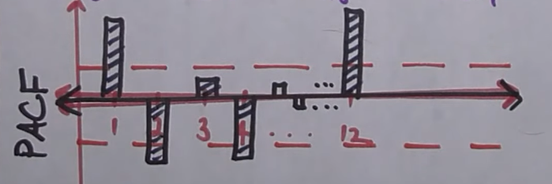
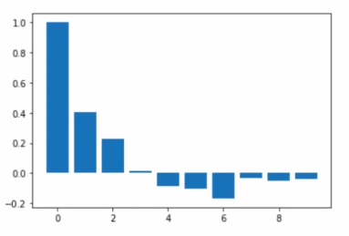
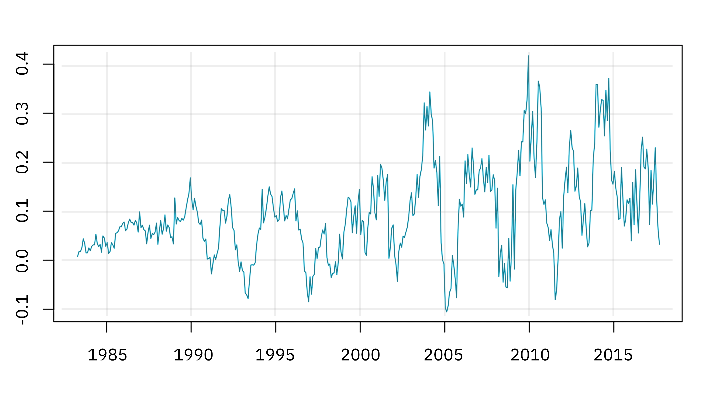

# Module 3 (Time Series Forecasting): AR, MA, ARMA, ARIMA, and SARIMA Models

Time series forecasting involves predicting future values based on historical data patterns. This module builds on the foundational concepts from Module 1 (Notebooks and Data Basics) and Module 2 (Data Exploration and Visualization) to introduce advanced forecasting models.

## Table of Contents

- [Module 3 (Time Series Forecasting): AR, MA, ARMA, ARIMA, and SARIMA Models](#module-3-time-series-forecasting-ar-ma-arma-arima-and-sarima-models)
  - [Table of Contents](#table-of-contents)
  - [Introduction to Time Series Forecasting with Python](#introduction-to-time-series-forecasting-with-python)
    - [1. Introduction](#1-introduction)
    - [2. Overview of Time Series Forecasting Models](#2-overview-of-time-series-forecasting-models)
      - [Step-by-Step Concept](#step-by-step-concept)
    - [3. Autoregressive (AR) Models](#3-autoregressive-ar-models)
      - [What is an AR Model?](#what-is-an-ar-model)
      - [Identification:](#identification)
    - [4. Moving Average (MA) Models](#4-moving-average-ma-models)
      - [What is an MA Model?](#what-is-an-ma-model)
      - [Identification:](#identification-1)
    - [5. ARMA Models](#5-arma-models)
      - [What is an ARMA Model?](#what-is-an-arma-model)
      - [When to Use ARMA:](#when-to-use-arma)
    - [6. ARIMA Models](#6-arima-models)
      - [What is an ARIMA Model?](#what-is-an-arima-model)
      - [Components:](#components)
      - [Model Selection:](#model-selection)
      - [More Intuition on Differencing:](#more-intuition-on-differencing)
    - [7. SARIMA Models](#7-sarima-models)
      - [What is a SARIMA Model?](#what-is-a-sarima-model)
      - [Seasonal Identification:](#seasonal-identification)
    - [8. Model Selection and Evaluation](#8-model-selection-and-evaluation)
      - [Evaluation Metrics](#evaluation-metrics)
      - [Residual Diagnostics](#residual-diagnostics)
    - [9. Implementation in Python](#9-implementation-in-python)
      - [Complete Forecasting Workflow](#complete-forecasting-workflow)
    - [10. Summary](#10-summary)
    - [Recommended Reading](#recommended-reading)
  - [Notebook Example](#notebook-example)


## Introduction to Time Series Forecasting with Python

### 1. Introduction

**Key Forecasting Models Covered:**

- **AR (Autoregressive)**: Models that use past values to predict future values
- **MA (Moving Average)**: Models that use past forecast errors (differences between actual and predicted values)
- **ARMA (Autoregressive Moving Average)**: Combines AR and MA components
- **ARIMA (Autoregressive Integrated Moving Average)**: ARMA for non-stationary data (trend)
- **SARIMA (Seasonal ARIMA)**: ARIMA with seasonal components

---

### 2. Overview of Time Series Forecasting Models

#### Step-by-Step Concept

1. **Model Identification**
   - Analyze ACF/PACF plots to identify model components
   - Determine AR, MA, and seasonal orders
2. **Parameter Estimation**
   - Use maximum likelihood estimation
   - Fit model parameters to historical data
3. **Model Validation**
   - Check residuals for white noise
   - Evaluate forecast accuracy
4. **Forecasting**
   - Generate point forecasts
   - Calculate prediction intervals

---

### 3. Autoregressive (AR) Models

#### What is an AR Model?

An AR(p) model predicts the current value as a linear combination of its past p values.

**Mathematical Form:**

$$
y_t = c + \phi_1 y_{t-1} + \phi_2 y_{t-2} + \dots + \phi_p y_{t-p} + \epsilon_t
$$

Where:

- $y_t$: Value at time t
- $c$: Constant term
- $\phi_i$: Autoregressive coefficients
- $\epsilon_t$: noise error

**Example:**

```python
from statsmodels.tsa.arima.model import ARIMA

# Fit AR(2) model
model = ARIMA(data, order=(2, 0, 0))
model_fit = model.fit()

# Make predictions
predictions = model_fit.forecast(steps=2)
```

#### Identification:

- PACF plot shows significant spikes up to lag p
- ACF decays gradually

  

> lag p = [1, 2, 4, 12], an AR(12) model may be appropriate

---

### 4. Moving Average (MA) Models

#### What is an MA Model?

An MA(q) model expresses the current value as a linear combination of past forecast errors.

**Mathematical Form:**

$$
y_t = \mu + \epsilon_t + \theta_1 \epsilon_{t-1} + \theta_2 \epsilon_{t-2} + \dots + \theta_q \epsilon_{t-q}
$$

Where:

- $\mu$: Mean of the series
- $\theta_i$: Moving average coefficients
- $\epsilon_t$: White noise errors

**Example:**

```python
from statsmodels.tsa.arima.model import ARIMA

# Fit MA(1) model
model = ARIMA(data, order=(0, 0, 1))
model_fit = model.fit()

# Forecast
forecast = model_fit.forecast(steps=10)
```

#### Identification:

- ACF plot shows significant spikes up to lag q
- PACF decays gradually

  

> splikes up to lag 3, an MA(3) model may be appropriate

---

### 5. ARMA Models

#### What is an ARMA Model?

ARMA(p,q) combines AR(p) and MA(q) components for stationary time series.

**Mathematical Form:**

$$
y_t = c + \phi_1 y_{t-1} + \dots + \phi_p y_{t-p} + \epsilon_t + \theta_1 \epsilon_{t-1} + \dots + \theta_q \epsilon_{t-q}
$$

**Example:**

```python
from statsmodels.tsa.arima.model import ARIMA

# Fit ARMA(2,1) model
model = ARIMA(data, order=(2, 0, 1))
model_fit = model.fit()

# Summary
print(model_fit.summary())
```

#### When to Use ARMA:

- Data is stationary
- No seasonal patterns
- Both AR and MA components needed

---

### 6. ARIMA Models

#### What is an ARIMA Model?

ARIMA(p,d,q) extends ARMA for non-stationary data by including differencing. In other words, it models trends in the data.

  

> The data trends upward, indicating non-stationarity. Differencing is needed.

#### Components:

| Component | Description          | Purpose                       |
| --------- | -------------------- | ----------------------------- |
| **AR(p)** | Autoregressive order | Past values                   |
| **I(d)**  | Integration order    | Differencing for stationarity |
| **MA(q)** | Moving average order | Past errors                   |

**Example:**

```python
from statsmodels.tsa.arima.model import ARIMA

# Fit ARIMA(2,1,1) model
model = ARIMA(data, order=(2, 1, 1))
model_fit = model.fit()

# Forecast with confidence intervals
forecast = model_fit.get_forecast(steps=10)
print(forecast.predicted_mean)
print(forecast.conf_int())
```

#### Model Selection:

- Use ACF/PACF plots
- Try different (p,d,q) combinations
- Choose model with lowest AIC/BIC

#### More Intuition on Differencing:

- d=0: No differencing (stationary)
- d=1: First difference (removes linear trend)
- d=2: Second difference (removes quadratic trend)

differencing is a way to make a non-stationary time series stationary by removing trends. This is done by subtracting the previous observation from the current observation. For example, if the original series is $Y_t$, the first difference is calculated as:

$$Y'_t = Y_t - Y_{t-1}$$

This is first-order differencing (d=1). If the first difference is still non-stationary, a second difference can be applied.

---

### 7. SARIMA Models

#### What is a SARIMA Model?

SARIMA extends ARIMA to handle seasonal patterns.

**Notation:** SARIMA(p,d,q)(P,D,Q,m)

Where:

- (p,d,q): Non-seasonal parameters
- (P,D,Q): Seasonal parameters
- m: Seasonal period

**Mathematical Form:**
Combines non-seasonal and seasonal ARIMA components.

**Example:**

```python
from statsmodels.tsa.statespace.sarimax import SARIMAX

# Fit SARIMA(1,1,1)(1,1,1,12) model for monthly data
model = SARIMAX(data, order=(1,1,1), seasonal_order=(1,1,1,12))
model_fit = model.fit()

# Forecast
forecast = model_fit.forecast(steps=12)
```

#### Seasonal Identification:

- Examine seasonal patterns in ACF/PACF
- Common seasonal periods: 12 (monthly), 7 (daily), 4 (quarterly)

---

### 8. Model Selection and Evaluation

#### Evaluation Metrics

<!-- | Metric   | Formula                              | Use Case                     |
| -------- | ------------------------------------ | ---------------------------- | --- | ---------------------- |
| **MAE**  | $\frac{1}{n}\sum                     | y_t - \hat{y}\_t             | $   | Average absolute error |
| **MSE**  | $\frac{1}{n}\sum(y_t - \hat{y}_t)^2$ | Penalizes large errors       |
| **RMSE** | $\sqrt{MSE}$                         | Error in original units      |
| **MAPE** | $\frac{100}{n}\sum                   | \frac{y_t - \hat{y}\_t}{y_t} | $   | Percentage error       | -->

| Metric   | Description                     | Formula                     | Use Case                             |
| -------- | ------------------------------- | ---------------------------- | ------------------------------------ |
| **MAE**  | Mean Absolute Error             | $\frac{1}{n}\sum  y_t - \hat{y}_t$             | Average absolute error               |
| **MSE**  | Mean Squared Error              | $\frac{1}{n}\sum(y_t - \hat{y}_t)^2$ | Penalizes large errors               |
| **RMSE** | Root Mean Squared Error         | $\sqrt{MSE}$                 | Error in original units              |
| **MAPE** | Mean Absolute Percentage Error  | $\frac{100}{n}\sum  \frac{y_t - \hat{y}_t}{y_t}$ | Percentage error                     |

where:

- $y_t$: Actual value at time t
- $\hat{y}_t$: Forecasted value at time t
- n: Number of observations

#### Residual Diagnostics

We can check the residuals of our fitted model to ensure they behave like white noise (i.e., no autocorrelation, constant mean and variance). If the residuals show patterns, it indicates that the model has not captured all the information in the data.

```python
# Check residuals
residuals = model_fit.resid

# Plot residuals
plt.figure(figsize=(12,8))
plt.subplot(311)
plt.plot(residuals)
plt.title('Residuals')

plt.subplot(312)
plot_acf(residuals, lags=20)
plt.title('ACF of Residuals')

plt.subplot(313)
plt.hist(residuals, bins=20)
plt.title('Residual Distribution')
plt.show()

# Ljung-Box test for autocorrelation
from statsmodels.stats.diagnostic import acorr_ljungbox
lb_test = acorr_ljungbox(residuals, lags=10)
print(lb_test)
```

---

### 9. Implementation in Python

#### Complete Forecasting Workflow

this code snippet demonstrates a complete workflow for time series forecasting using ARIMA models in Python.

```python
import pandas as pd
import numpy as np
import matplotlib.pyplot as plt
from statsmodels.tsa.arima.model import ARIMA
from statsmodels.tsa.statespace.sarimax import SARIMAX
from statsmodels.graphics.tsaplots import plot_acf, plot_pacf
from sklearn.metrics import mean_squared_error
import warnings
warnings.filterwarnings('ignore')

# Load data (assuming time series data)
data = pd.read_csv('time_series_data.csv', parse_dates=['date'], index_col='date')

# Exploratory analysis (from Module 2)
print(data.head())
print(data.describe())

# Check stationarity (from Module 2)
from statsmodels.tsa.stattools import adfuller
result = adfuller(data['value'])
print(f'ADF Statistic: {result[0]}')
print(f'p-value: {result[1]}')

# If non-stationary, difference
if result[1] > 0.05:
    data_diff = data['value'].diff().dropna()
else:
    data_diff = data['value']

# ACF/PACF plots
plot_acf(data_diff, lags=20)
plot_pacf(data_diff, lags=20)
plt.show()

# Fit ARIMA model (adjust p,d,q based on plots)
model = ARIMA(data['value'], order=(1, 1, 1))
model_fit = model.fit()

# Model summary
print(model_fit.summary())

# Forecast
forecast_steps = 10
forecast = model_fit.forecast(steps=forecast_steps)

# Plot results
plt.figure(figsize=(12,6))
plt.plot(data.index, data['value'], label='Historical')
plt.plot(pd.date_range(start=data.index[-1], periods=forecast_steps+1, freq='D')[1:],
         forecast, label='Forecast', color='red')
plt.legend()
plt.show()

# Evaluate on test set
train_size = int(len(data) * 0.8)
train, test = data[:train_size], data[train_size:]

model = ARIMA(train['value'], order=(1,1,1))
model_fit = model.fit()

predictions = model_fit.forecast(steps=len(test))

rmse = np.sqrt(mean_squared_error(test['value'], predictions))
print(f'RMSE: {rmse}')
```

### 10. Summary

| Model            | Use Case                    | Stationary? | Seasonal? | Parameters    |
| ---------------- | --------------------------- | ----------- | --------- | ------------- |
| **AR(p)**        | Past values predict future  | Yes         | No        | p             |
| **MA(q)**        | Past errors predict future  | Yes         | No        | q             |
| **ARMA(p,q)**    | Both past values and errors | Yes         | No        | p, q          |
| **ARIMA(p,d,q)** | Non-stationary data         | No          | No        | p, d, q       |
| **SARIMA**       | Seasonal data               | No          | Yes       | p,d,q,P,D,Q,m |

```
Data Preparation → Stationarity Check → Model Identification → Parameter Estimation → Validation → Forecasting
```

### Recommended Reading

- [Youtube Playlist](https://www.youtube.com/watch?v=5-2C4eO4cPQ&list=PLvcbYUQ5t0UHOLnBzl46_Q6QKtFgfMGc3&index=9) video 9 to 23
- Statsmodels Documentation: https://www.statsmodels.org/stable/tsa.html

## Notebook Example

This notebook provides a practical implementation of an AR model, you can experiment with the number of lags, change it into an MA, ARMA, ARIMA, or SARIMA model, and see how the forecasts change. Try to improve the accuracy of the model!

https://colab.research.google.com/drive/1RRBcZphkeGuFdY8ykX0HxqinDVh7clla?usp=sharing